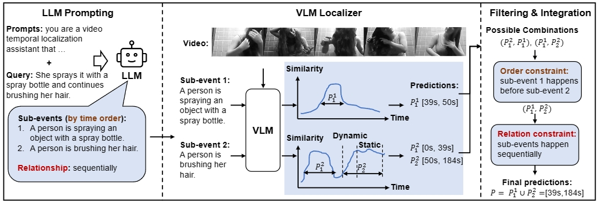

# Training-free Zero-Shot Video Temporal Grounding using Large-scale Pre-trained Models

In this work, we propose a training-free zero-shot video temporal grounding approach that leverages the ability of pre-trained large models. Our method achieves the best performance on zero-shot video temporal grounding on Charades-STA and ActivityNet Captions datasets without any training and demonstrates better generalization capabilities in cross-dataset and OOD settings.

Our paper was accepted by ECCV-2024.



## Quick Start

### Requiments
- pytorch
- torchvision
- tqdm
- salesforce-lavis
- sklearn
- json5

### Data Preparation

To reproduce the results in the paper, we provide the pre-extracted features of the VLM in [this link](https://disk.pku.edu.cn/link/AA3641EABF29EE483F8AE89E1C149DD496) and the outputs of the LLM in [`dataset/charades-sta/llm_outputs.json`](dataset/charades-sta/llm_outputs.json) and [`dataset/activitynet/llm_outputs.json`](dataset/activitynet/llm_outputs.json). Please download the pre-extracted features and configure the path for these features in [`data_configs.py`](data_configs.py) file.

## Main Results

### Standard Split

```bash
# Charades-STA dataset
python evaluate.py --dataset charades --llm_output dataset/charades-sta/llm_outputs.json

# ActivityNet dataset
python evaluate.py --dataset activitynet --llm_output dataset/activitynet/llm_outputs.json
```

| Dataset        | IoU=0.3 | IoU=0.5 | IoU=0.7 |  mIoU   |
| :-----         | :-----: | :-----: | :-----: | :-----: |
|  Charades-STA  |  67.04  |  49.97  |  24.32  |  44.51  |
|  ActivityNet   |  49.34  |  27.02  |  13.39  |  34.10  |


### OOD Splits

```bash
# Charades-STA OOD-1
python evaluate.py --dataset charades --split OOD-1

# Charades-STA OOD-2
python evaluate.py --dataset charades --split OOD-2

# ActivityNet OOD-1
python evaluate.py --dataset activitynet --split OOD-1

# ActivityNet OOD-2
python evaluate.py --dataset activitynet --split OOD-2
```

| Dataset              | IoU=0.3 | IoU=0.5 | IoU=0.7 |  mIoU   |
| :-----               | :-----: | :-----: | :-----: | :-----: |
|  Charades-STA OOD-1  |  66.05  |  45.91  |  20.78  |  43.05  |
|  Charades-STA OOD-2  |  65.75  |  43.79  |  19.95  |  42.62  |
|  ActivityNet OOD-1   |  43.87  |  20.41  |  11.25  |  31.72  |
|  ActivityNet OOD-2   |  40.97  |  18.54  |  10.03  |  30.33  |


```bash
# Charades-CD test-ood
python evaluate.py --dataset charades --split test-ood

# Charades-CG novel-composition
python evaluate.py --dataset charades --split novel-composition

# Charades-CG novel-word
python evaluate.py --dataset charades --split novel-word
```

| Dataset                           | IoU=0.3 | IoU=0.5 | IoU=0.7 |  mIoU   |
| :-----                            | :-----: | :-----: | :-----: | :-----: |
|  Charades-STA test-ood            |  65.07  |  49.24  |  23.05  |  44.01  |
|  Charades-STA novel-composition   |  61.53  |  43.84  |  18.68  |  40.19  |
|  Charades-STA novel-word          |  68.49  |  56.26  |  28.49  |  46.90  |

## Test on Custom Datasets

### Feature Extraction

Please run `feature_extraction.py` to obtain the video features of your datasets.

```bash
python feature_extraction.py --input_root VIDEO_PATH --save_root FEATURE_SAVE_PATH
```

### Data Configuration

Please add your dataset in the `data_configs.py`. You may need to adjust the stride and max_stride_factor to achieve better performance.

The format of the annotation file can refer to `dataset/charades-sta/test_trivial.json`.

### Test without LLM

To test the performance with only VLM, please run:

```bash
python evaluate.py --dataset DATASET --split SPLIT
```

`DATASET` and `SPLIT` are the dataset name and split that you add in the `data_configs.py`.

### Test with LLM

To obtain the outputs of LLM, please run:

```bash
python get_llm_outputs.py --api_key API_KEY --input_file ANNOTATION_FILE --output_file LLM_OUTPUT_FILE
```

We have implemented models from OpenAI, Google, and Groq. You can specify the model using `--model_type` and select a specific model with `--model_name`. You will need to apply for the corresponding model's API key and install the necessary dependencies, such as `openai`, `google-generativeai`, or `groq`.

To test the performance, please run:

```bash
python evaluate.py --dataset DATASET --split SPLIT --llm_output LLM_OUTPUT_FILE
```